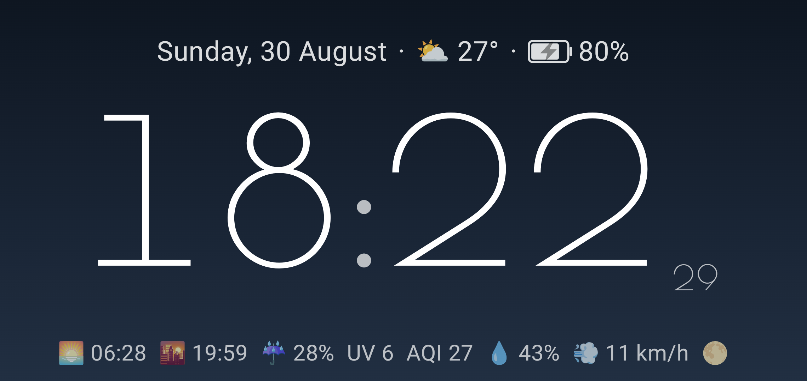
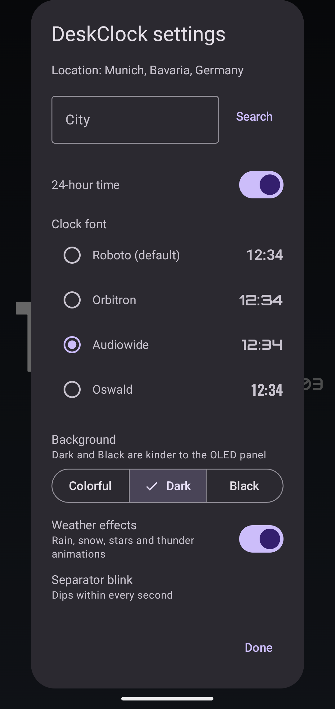
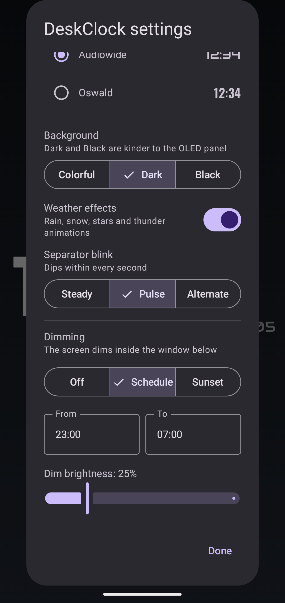

# DeskClock

Always-on desk clock for a permanently-docked, permanently-charging phone on a stand.
Date, weather and battery on top, big time in the middle, today's conditions along the bottom.



## Features

- **Huge clock** (12/24h) with a small **seconds counter** and a separator that **blinks with the
  seconds**, sized from measured text to fill the screen, **landscape-first but rotation aware**.
- **27 selectable clock fonts** (system Roboto plus 26 bundled OFL faces from Google Fonts), with
  **live previews** in settings. The clock is sized from the **actual time string**, so every font
  fills the screen edge to edge.
- **Info row** above the clock: full **date and day**, current **weather** (temperature +
  condition), **battery** icon with percentage. The bolt shows whenever power is connected — solid
  while charging, faint while a **charge limiter** is holding the level.
- **Conditions strip** along the bottom: **sunrise and sunset**, today's **precipitation
  probability**, max **UV index**, **air quality** (European AQI), **humidity**, **wind**, and the
  current **moon phase** (computed locally, no network).
- Weather and air quality from **[Open-Meteo](https://open-meteo.com)** — **keyless** and free for
  non-commercial use. Location is a city picked once in settings, so the app needs **no location
  permission**; `INTERNET` is its only permission.
- **Day/night theme** switched by the location's **real sunrise/sunset** (from the same weather
  response), with a 07:00/19:00 fallback when offline.
- **Dimming modes**: **Off**, **Schedule** (user-set window, default 22:00–06:00), or **Sunset**
  (sunset→sunrise). **Dim brightness** sets the backlight level while dimmed: 100% = no dimming,
  lower = dimmer.
- **Weather-reactive background** (clear / clouds / fog / rain / snow / thunder) — plus low-alpha
  **animations** behind the clock (capped at ~30 fps): rain streaks, snowflakes, stars on clear
  nights, faint thunder flashes (switchable off in settings). Three background modes:
  **Colorful** (bright day gradients), **Dark** (deep weather tints all day, the default — kinder
  to an always-on OLED), or **Black** (pure black at all times).
- **Separator blink modes**: **Steady**, **Pulse** (dips within every second), or **Alternate**
  (bright/dim on alternate seconds, the default).
- **OLED burn-in protection**: the whole layout drifts a few dp to a new position every minute.
- Screen is **held on** via `FLAG_KEEP_SCREEN_ON` while the app is in the foreground.

## Settings

Long-press anywhere → settings. The dialog opens by itself on first launch, before a location is
set.

| | |
|:---:|:---:|
|  |  |

## Build

```sh
./gradlew assembleDebug     # drops DeskClock-v<version>.apk in the repo root
./gradlew assembleRelease   # signed release, if keystore.properties + keystore exist (not in VCS)
```

Requires a JDK 17+ and an Android SDK pointed to by `local.properties` (machine-local, not
committed).

## License

[MIT](LICENSE). Bundled fonts are under the
[SIL Open Font License 1.1](THIRD_PARTY_LICENSES.md) from
[Google Fonts](https://fonts.google.com); weather, air quality, and geocoding by
[Open-Meteo](https://open-meteo.com), free for non-commercial use — see
[THIRD_PARTY_LICENSES.md](THIRD_PARTY_LICENSES.md).
